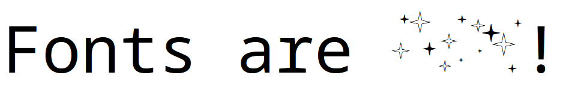

# Logo Lig

Injects a logo into a TTF font as a ligature. Type a trigger sequence
in any ligature-aware tool and the logo renders in place of the text. The
replacement is context aware and will only trigger when the sequence is not
part of another number or string. Punctuation and whitespace may precede or
follow the sequence.

```
uv run font-lig --font input.ttf --logo cool.png --out output.ttf --sequence "cool" --family-name "Font + Cool"

echo "Fonts are cool!"
```



## Existing Tools

There are lots of ways to make your own font. I didn't see anything obvious and single-purpose to achieve this
but would be thrilled if there is an existing tool that I overlooked!

## What it does

1. If logo is not an SVG, convert with vtracer
2. Parses the SVG paths and scales them to cap-height
3. Injects the result as a new glyph
4. Adds a GSUB ligature rule mapping the trigger sequence to the glyph

I've only tested a handful of fonts. Monospace and non-monospace, ligatured and
ligature-free fonts should all work.

`--family-name` is required. Always give the output font a new name. Installing
it under the original name will shadow the real font and confuse applications.

## Learned

**Transparency.** I couldn't figure out how to make vtracer handle alpha. I kept
getting stray Move points that left lines between shapes. My fix was to
composite the image onto a white background first and convert to grayscale
before tracing. I'm sure there is a better way to do this.

**Y-axis.** SVG coordinates increase downward. Font coordinates increase upward.
The transform that flips them is:

```
x' = (x - xmin) * scale
y' = (ymax - y) * scale
```

Which encodes as `Transform(scale, 0, 0, -scale, -xmin*scale, ymax*scale)`. I
definitely mixed up the signs a few times on this.

**Extension lookups.** Fonts frequently wrap their GSUB lookups in Type 7
(Extension) wrappers to get around the 16-bit subtable offset limit. My
original, naive search for LookupType 4 (ligature substitution) walked right
past them. You have to unwrap the ExtSubTable and check what is inside.

**Coverage tables.** The OpenType ligature substitution format requires a
Coverage table listing which glyphs can start a substitution. It seemed like
something that needed manual maintenance. It does not! fontTools rebuilds it
automatically from the ligatures dict keys when serializing. Adding manual
update code was not only unnecessary but produced corrupt output.

**Debugging bad output.** Firefox gives cleaner font error messages than most
editors. Load the font with a quick HTML file and open the console. Once you
have an error, `ttx -t GSUB output.ttf` dumps the GSUB table as readable XML
and usually shows exactly what is malformed. There are fontTools validators for
most tables.

**Editor font cache.** After replacing or reinstalling a font, editors often
keep the old version in memory. VS Code needs a full restart, not just a window
reload. Some editors on Linux need `fc-cache -f` first.

**Glyph order.** fontTools asserts that the glyph order list matches the
glyf table on save. You must call `font.setGlyphOrder()` before writing
into `font["glyf"]`, not after.

## PUA mapping

The new glyph is assigned a code point in the Unicode Private Use Area
(U+E001). This is what gives the glyph a stable character identity so the
ligature rule can reference it, without colliding with real characters.
